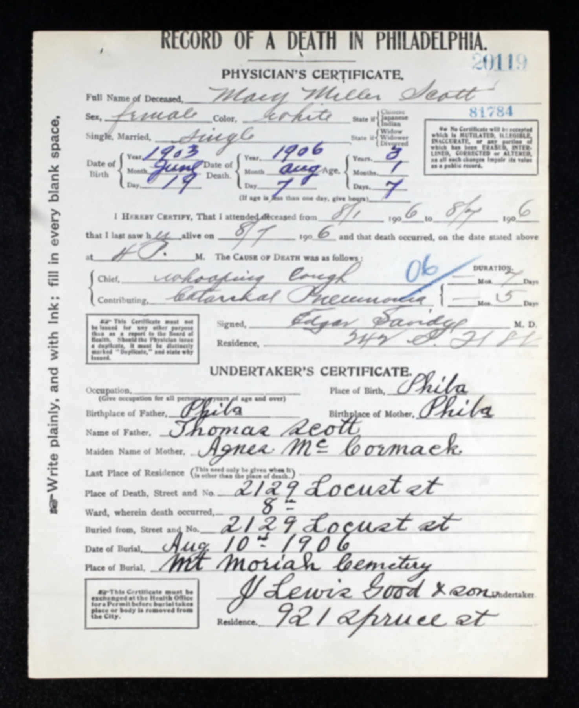
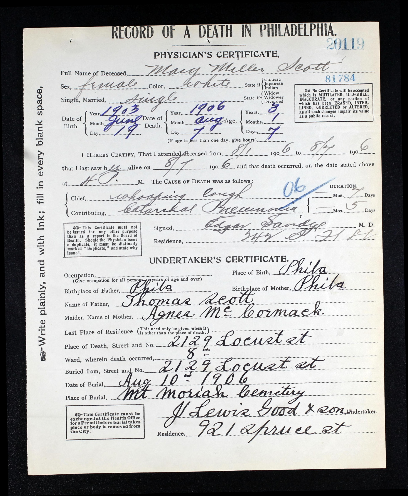
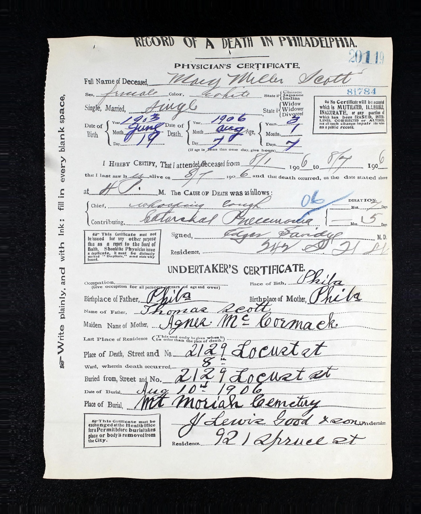
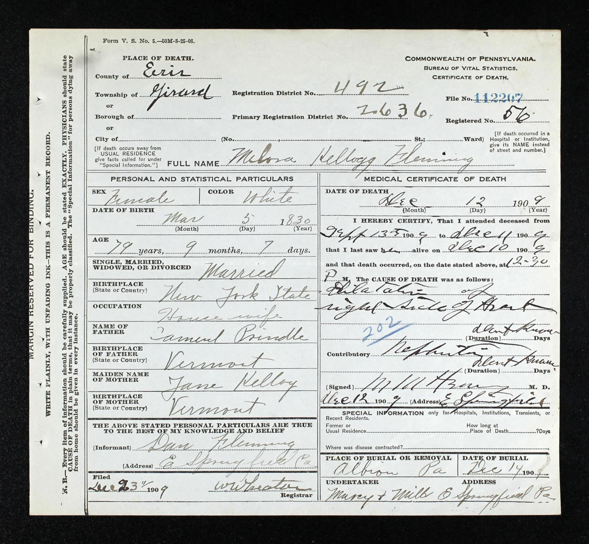

# Pennsylvania Death Records 622

Public landing page for the official 622-image Pennsylvania death-record subset used in [arXiv:2509.09722](https://arxiv.org/abs/2509.09722).

This repo intentionally stays lightweight:

- it does not publish the full image payload in the Git tree
- it keeps the release docs and official labels easy to inspect
- it shows a few small preview renders from representative official records
- it avoids local filesystem paths in public-facing text

## Download

The dataset release tarball is named:

- `PA_DEATH_RECORDS_622_v1.tar.gz`

The public archive should be published as a GitHub Release asset for this repository.

## Official sources

- Official labels: `data/official/5164_gts.csv`
- Raw traceability labels: `data/raw/raw_5164_gts_622_FIXED_v2.csv`
- Intermediate label export: `data/raw/5164_gts_no_post_processing.csv`
- Release paper: [arXiv:2509.09722](https://arxiv.org/abs/2509.09722)

## Preview images

These are small preview renders from representative official records. They are included so the public README actually shows images.

  
  
  
  

## Example data

Representative rows from the official release:

| ImageFileName | SelfGivenName | SelfSurname | SelfBirthPlace |
| --- | --- | --- | --- |
| `41381_1220705043_0549-01468.jpg` | Raymond | Merrell | Phila |
| `41381_1220705043_0549-04785.jpg` | Mary Miller | Scott | Phila |
| `41381_1220705043_0567-00432.jpg` | Melora Kellogg | Fleming | New York State |
| `41381_1220705043_0567-03648.jpg` | Robert M | Phinney | Pa |

## Data dictionary

See [DATA_DICTIONARY.md](DATA_DICTIONARY.md) for field definitions and normalization notes.

## Important notes

- Names have been generally reviewed.
- Other fields may be standardized and may not be literal character-for-character matches to the source certificates.
- The official release should be treated as a curated research dataset, not a verbatim transcription of every source field.
