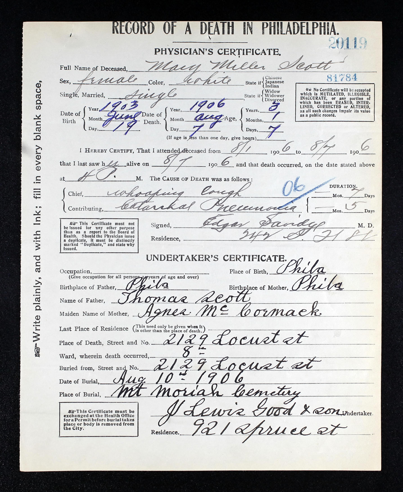
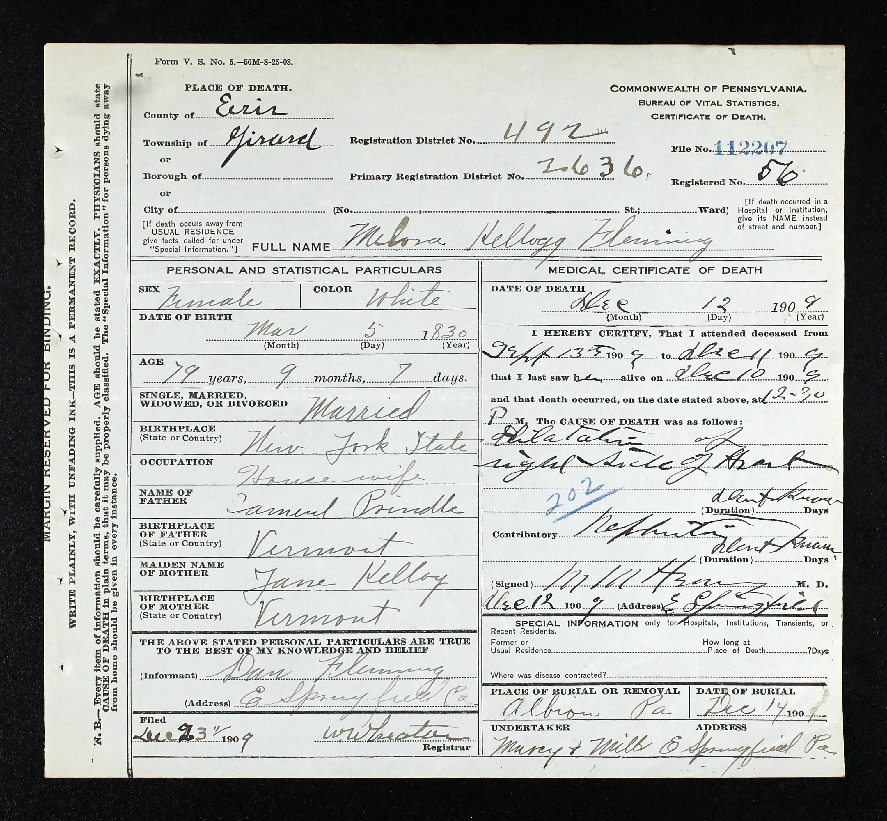

# Pennsylvania Death Records 622

Curated 622-image Pennsylvania death-record subset used in [arXiv:2509.09722](https://arxiv.org/abs/2509.09722).

## Download

Current release:

- [PA_DEATH_RECORDS_622_v1.0.1.zip](https://github.com/Tahlor/pa-death-records-622/releases/download/v1.0.1/PA_DEATH_RECORDS_622_v1.0.1.zip)
- [SHA256SUMS.txt](https://github.com/Tahlor/pa-death-records-622/releases/download/v1.0.1/SHA256SUMS.txt)

Release page:

- [v1.0.1 release notes](https://github.com/Tahlor/pa-death-records-622/releases/tag/v1.0.1)

## Files included in the release archive

The downloadable zip contains the full image set plus release metadata. Expected top-level paths inside the zip are:

- `images/` - 622 image files
- `data/official/5164_gts.csv` - official label CSV
- `examples/example_labels.csv` - small sample label table
- `CITATION.cff` - citation metadata
- `LICENSE.md` - repository/documentation license note
- `RELEASE_NOTES.md` - release summary and limitations
- `DATA_DICTIONARY.md` - field definitions and normalization notes

## Representative sample images

Representative original record images are committed in the repo so the landing page shows actual images on GitHub.

  
  

## Example image-to-GT pairs

Each image below is the original record image shown next to the matching ground-truth fields from the official label CSV.

### `41381_1220705043_0549-04785.jpg`

| Field | Ground truth |
| --- | --- |
| `ImageFileName` | `41381_1220705043_0549-04785.jpg` |
| `SelfGivenName_orig` | `Mary Miller` |
| `SelfGivenName_edt` | `Mary Miller` |
| `SelfSurname_orig` | `Scott` |
| `SelfSurname_edt` | `Scott` |
| `SelfBirthPlace_orig` | `Phila` |
| `SelfBirthPlace_edt` | `Philadelphia, Pennsylvania` |

### `41381_1220705043_0567-00432.jpg`

| Field | Ground truth |
| --- | --- |
| `ImageFileName` | `41381_1220705043_0567-00432.jpg` |
| `SelfGivenName_orig` | `Melora Kellogg` |
| `SelfGivenName_edt` | `Melora Kellogg` |
| `SelfSurname_orig` | `Fleming` |
| `SelfSurname_edt` | `Fleming` |
| `SelfBirthPlace_orig` | `New York State` |
| `SelfBirthPlace_edt` | `New York` |

See [examples/example_labels.csv](examples/example_labels.csv) for a CSV version of the same image-to-GT pairs.

## Data fields

The official CSV uses paired `_orig` and `_edt` columns for names and places, plus a stable image key and archive-relative image path.

- [DATA_DICTIONARY.md](DATA_DICTIONARY.md)
- The official release CSV in the archive is the source of truth for experiments.

## Usage notes

- The official release labels are curated and may include normalization or standardization in `_edt` fields.
- `_orig` means the source-keyed or earlier captured form that is closest to the original transcription, but it is not guaranteed to be a literal verbatim copy of the source record.
- `_edt` means the curated and potentially normalized form used for the official release.
- The release archive is the canonical public download.

## Citation

If you use this release, cite the paper and the release URL:

- [arXiv:2509.09722](https://arxiv.org/abs/2509.09722)
- [GitHub release v1.0.1](https://github.com/Tahlor/pa-death-records-622/releases/tag/v1.0.1)

## License and terms

Documentation in this repository is provided for public release reference.
The image scans and label data in the downloadable archive may remain subject to the source-record access terms that governed their collection.
This repository does not claim to relicense those source records.

## Contact and issues

Use [GitHub Issues](https://github.com/Tahlor/pa-death-records-622/issues) for questions or corrections.
